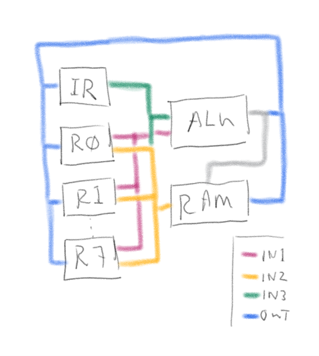

# ARM16
- 2 clock cycles per instruction
  - rising edge instruction fetch?
  - falling edge for exec?
- 16 bit instructions word aligned
- 16 bit registers
- 8 registers, R7 is program counter
- 4 bit status register
- status register always updated on ALU operations

## Data paths


## Instruction set

| Assembly | Bits | IN1 | IN2 | IN3 | OUT | Notes
| -------- | ---- | ----- | --- | --- | --- | ---
| ldr Rd, [Ra, #x] | `aaad dd00 xxxx xxxx` | Ra   |    | IR  | RAM->Rd
| str Rm, [Ra, #x] | `aaam mm01 xxxx xxxx` | Ra   | Rm | IR  |         | could have writeback?
| alu Ra, #x       | `aaad dd10 xxxx xxxx` | Ra   |    | IR  | ALU->Ra
| b\<c\> x         | `cccc xx11 0xxx xxx0` | R7   |    | IR  | ALU->7
| swi x            | `xxxx xx11 0xxx xxx1` | 8000 |    | IR  | ALU->7
| shu Ra, #x       | `aaad dd11 1000 xxxx` | Ra   |    | IR  | ALU->Ra
| alu Ra, Rm       | `aaad dd11 1001 0mmm` | Ra   | Rm | IN2 | ALU->Ra
| shu Ra, Rm       | `aaad dd11 1001 1mmm` | Ra   | Rm | IN2 | ALU->Ra

```txt
cccc
0000 nv     0100 cc/lo  1000 vc  1100 lt
0001 eq     0101 mi     1001 hi  1101 gt
0010 ne     0110 pl     1010 ls  1110 le
0011 cs/hs  0111 vs     1011 ge  1111 al

dddd
0000 mov   0100 add   1000 lsl   1100 rrx
0001 and   0101 adc   1001 lsr   1101 cmp
0010 orr   0110 sub   1010 asr   1110 tst
0011 eor   0111 sbc   1011 ror   1111

ddd ALU                ddd SHU
000 mov   100 add      000 lsl   100 rrx
001 and   101 adc      001 lsr
010 orr   110 sub      010 asr
011 eor   111 sbc      011 ror   111 lnk

sr = NZCV .... .... ....
```


## Memory map
```txt
      +-------------+
 0000 | reset       | 8 words
 0010 | mapped io   | 4kb - 8 words
 1000 |             |                  ROM
      |             |
      |             |
      +-------------+ 32kb
 8000 | swi vectors | 8kb (or 8000 - 8080, 64 words?)
 A000 |             |
      |             |                  RAM
      |             |
      |             |
10000 +-------------+ 64kb
```

## TODO

- Can we load from byte boundary (as opposed to word boundary)
- Can we set/clear/read status bits?
- MVN? (not)
